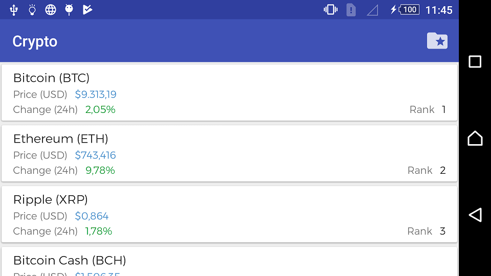

# Android Crypto

## Short description

- Client app to show information about cryptocurrencies, including their price, market cap, volume, etc... The app users will be able to manage their own crypto portfolio.
- This app is able to download information about cryptocurrencies from an API and show that information in the app. The app has one view that shows all cryptocurrencies. Each cell of the list shows the name, current price, and percentage change of the cryptocurrency.
- The app has a second view that shows all the specific details about a cryptocurrency. It shows when a user taps on a cryptocurrency from the list. The information is provided by the API. Additionally, and most important, it displays historical data of the cryptocurrency price. This information is displayed on a chart.
- Finally, there is a third view which will show the user portfolio. A portfolio is a list of cryptocurrencies a user owns. For each cryptocurrency we save the amount, the price and the date the user made the trade. The user is able to add cryotocurrencies to its portfolio from the detail view. It shows the total price in USD for each cryptocurrency the user owns and for the hole portfolio.
- This app has offline mode.
- This app uses Realm.

## Architecture

- The application uses a layered architecture (`ui`, `presenter`, `domain` and `data`). 
- Each layer has its own models with its mappers.
- The `ui` layer gets all what it needs from the `presenter` layer.
- The `presenter` layer is the _man in the middle_ that connects the visual part (`ui` layer) with the data through the `domain` layer.
- The `domain` layer manages the background calls to the `data` layer.
- The `data` layer is a `repository`. This layer gets the data from a `client`. The `client`, through a `service`, accesses this data. 

## What moves this application:

- `Dagger 2` for the dependency injection.
- `Butterknife`for the view bindings.
- `RxJava` for the asynchronous calls.
- `Retrofit` as an http client.  
- `Calligraphy` for the font faces.
- `MPAndroidChart` for the LineCharts.  

## Screenshots

## License
    Copyright 2018 Esteban Latre

    Licensed under the Apache License, Version 2.0 (the "License");
    you may not use this file except in compliance with the License.
    You may obtain a copy of the License at

        http://www.apache.org/licenses/LICENSE-2.0

    Unless required by applicable law or agreed to in writing, software
    distributed under the License is distributed on an "AS IS" BASIS,
    WITHOUT WARRANTIES OR CONDITIONS OF ANY KIND, either express or implied.
    See the License for the specific language governing permissions and
    limitations under the License.
